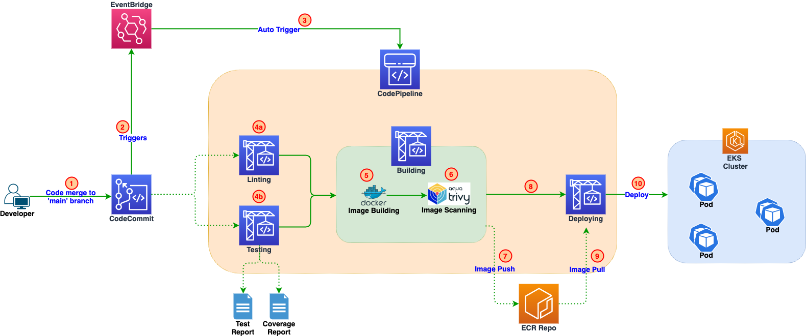

## Overview

This pattern describes how to build a multi-stage AWS CodePipeline (CI/CD - Continuous Integration / Continuous Delivery) to automatically build Docker image, test it, push it to Amazon ECR (Elastic Container Repository) and then deploy to Amazon EKS (Elastic Kubernetes Service) Cluster, using Terraform.

Pipeline is auto triggered on releasing the code to AWS CodeCommit Repo. First, it auto execute unit test cases before building the Docker Image, which is pushed to Amazon ECR. In next stage, pipeline automatically fetches the Docker image and deploys it to EKS Cluster.

This complete implementation is done as IaC (Infrastructure as Code) using Terraform. There is also a  python sample API code to help test the provisioned CI/CD pipeline.

## Prerequisites 


- An active AWS account.

- AWS Command Line Interface (AWS CLI) version 2, installed and configured. For more information about this, see <a></a>[Installing, updating, and uninstalling the AWS CLI version 2](https://docs.aws.amazon.com/cli/latest/userguide/install-cliv2.html) in the AWS CLI documentation.

- AWS CLI version 2 configured with the IAM (Identity & Access Management) user that is authorised to add other IAM users, groups, or roles to the aws-auth <a></a>[ConfigMap](https://docs.aws.amazon.com/eks/latest/userguide/add-user-role.html) in EKS Cluster. For information and steps to configure AWS CLI, see <a></a>[Configuration basics](https://docs.aws.amazon.com/cli/latest/userguide/cli-configure-quickstart.html) in the AWS CLI documentation.  

- AWS CLI version 2 configured with the IAM user that is authorised to provision AWS CodeCommit, AWS CodeBuild, AWS CodePipeline, Amazon EventBridge, Amazon ECR and AWS IAM Roles & Policies. 

- An existing Amazon EKS (Elastic Kubernetes Service) Cluster.


## Product Versions
```
- Terraform - v0.12 or later

- AWSCLI - v2.x

- EKS - v1.20 or later
```

## Architecture




### CI/CD Workflow
```
1. Developer's code merge request was reviewed and merged in "main" branch of AWS CodeCommit Repo.

Once PR is merged to main branch:

2. An event is created and sent to Amazon EventBridge.

3. Amazon EventBridge then triggers the AWS CodePipeline based on AWS Event rule configured.

4. AWS CodePipeline runs Testing and Linting as two parallel actions of the Test Phase, which takes AWS CodeCommit Repo as input source.

On successful test result - Build Phase is initiated in which:

5. Docker image is built,

6. Scanned for security vulnerabilities by using Aqua Trivy.

If ZERO CRITICAL vulnerability reported by Trivy:

7. Docker image is stored in Amazon ECR Repo.

8. Deploy Phase is initiated in which,

9. Docker image is pulled from Amazon ECR Repo and

10. Deployed to Amazon EKS Cluster.
```


## Repository Structure

- Terraform scripts under cicd directory

- Sample python api for demo under demo-app

*For deployment, refer README in respective sub-repo