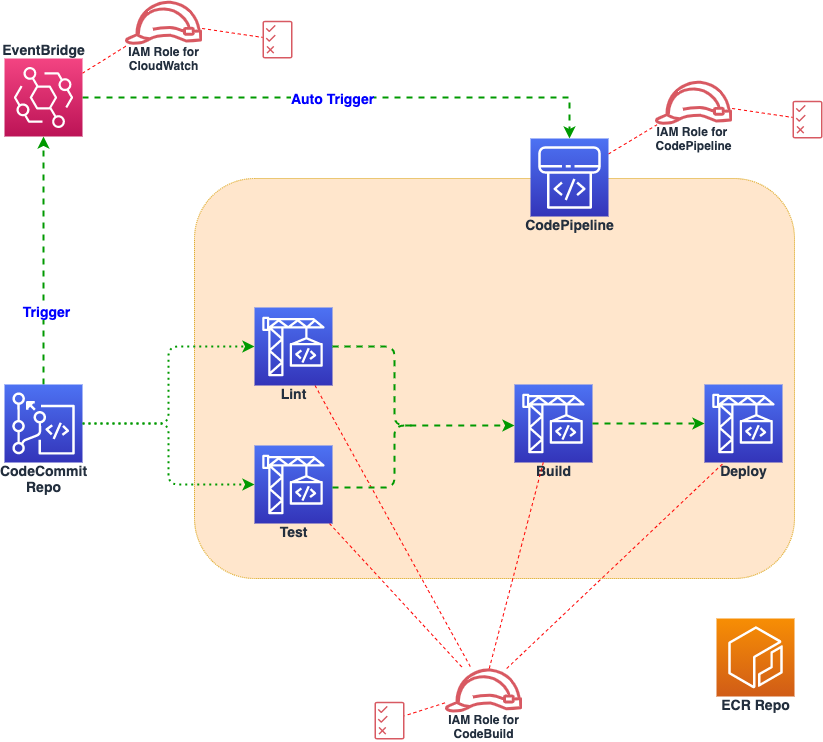

## Overview

This Sub-Repo contains Terraform scripts to provision a multi-stage AWS CodePipeline, which automatically build Docker image, test it, push it to Amazon ECR (Elastic Container Repository) and then deploy to Amazon EKS (Elastic Kubernetes Service) Cluster, using Terraform.


## Prerequisites

- Download terraform binary -  <a></a>[Download](https://www.terraform.io/downloads)

- Use <a></a>[installation instructions](https://learn.hashicorp.com/tutorials/terraform/install-cli) to install Terraform CLI

- Follow prerequisites from parent <a></a>[README](../README.md#prerequisites)


## Architecture




## Sub Repository Structure

- tf files are split per resource for easy readability/organization

- IAM policies are in policies directory


## Deployment Steps

### Deploy
```
your workstations aws cli to use the appropriate Admin user credentials (aws configure), or assume the Admin role.

From your workstation in the top level directory of the code:

- Run terraform init

- Run terraform apply

Type Yes after verifying what will be build to deploy the infrastructure.

Your infrastructure should now begin to deploy.
```

### Destroy
```
From your workstation in the top level directory of the code:

Run terraform destroy

Type Yes after verifying what will be destroyed.

Your infrastructure should now begin to be decomissioned.

* If any of the resource is not destroyed because of other dependencies, then delete them manually.
```